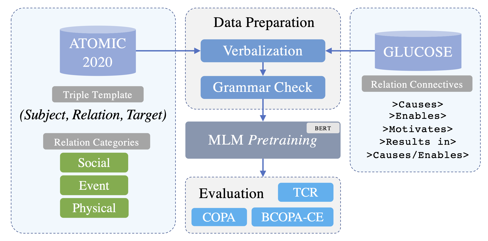

# Commonsense Causal Reasoning

<p align="center">
  
</p>

## Converting Knowledge Graphs to Text
### ATOMIC-to-Text
Triples in ATOMIC are stored in form of: `(subject, relation, target)`. We convert (verbalize) these triples to natural language text to later use them in training/fine-tuning some Pretrained Language Models (PLMs):
1. Download ATOMIC 2020 [here](https://allenai.org/data/atomic-2020), put the zip file in the `/data` folder, and unzip it (we only need `dev.tsv` and `train.tsv`).
2. Run the following code: [`atomic_to_text.py`](https://github.com/phosseini/causal-reasoning/blob/main/atomic_to_text.py) (depending on whether you're running the grammar check, this may take a while.)
3. Outputs will be stored as `.txt` and `.csv` files in the `/data` folder following the name patterns: `atomic2020_dev.*` and `atomic2020_train.*`.

### GLUCOSE-to-Text
1. Download GLUCOSE [here](https://tinyurl.com/yyeo92pt), unzip the file, and put the `GLUCOSE_training_data_final.csv` file in the `/data` folder.
2. Run the following code: [glucose_to_text.py](https://github.com/phosseini/causal-reasoning/blob/main/glucose_to_text.py)
3. Output will be stored in: `data/glucose_train.csv`

## Continual Pretraining
Once we verbalized the ATOMIC knowledge graph and GLUCOSE dataset to text, we continually pretrain a Pretrained Language Model (PLM), BERT here, using the converted texts. We call this pretraining step a **continual pretraining** since we use one of the objectives, Masked Language Modeling (MLM) that was originally used in pretraining BERT, to further train the PLM. There are two steps for running the pretraining:
* Setting the parameters in the [`config/pretraining_config.json`](https://github.com/phosseini/causal-reasoning/blob/main/config/pretraining_config.json): Even though most of these parameters are self-descriptive, we give a brief explanation about some of them for clarification purposes:
  * `relation_category` (for ATOMIC): A list of triple types (strings) with which we want to continually pretrain our model. There are three main categories of triples in ATOMIC: `event`, `social`, and `physical`. These categories may deal with different types of knowledge. And, models pretrained with each of these categories or a combination of them may give us different results when fine-tuned and tested on downstream tasks. As a result, we added an option for choosing the triple type(s) with which we want to run the pretraining.
* Runnig the pretraining code: [`pretraining.py`](https://github.com/phosseini/causal-reasoning/blob/main/pretraining.py)

### Using our continually pretrained model on HuggingFace🤗
Our models are deployed on the [HuggingFace's model hub](https://huggingface.co/models). Here is an example of how you can load the models:

```python
from transformers import AutoTokenizer, AutoModel

# bert tokenizer
tokenizer_bert = AutoTokenizer.from_pretrained("bert-large-cased")

atomic_bert_model = AutoModel.from_pretrained("phosseini/atomic-bert-large")
glucose_model = AutoModel.from_pretrained("phosseini/glucose-bert-large")

# roberta tokenizer
tokenizer_roberta = AutoTokenizer.from_pretrained("roberta-large")
atomic_roberta_model = AutoModel.from_pretrained("phosseini/atomic-roberta-large")
```

## Fine-tuning
After pretraining the PLM with the new data, it is time to fine-tune and evaluate its performance on downstream tasks. So far, we have tested our models on two benchmarks including COPA and TCR. In the following, we explain the fine-tuning process for each of them.
### COPA (Choice of Plausible Alternatives)
* Run the [`convert_copa.py`](https://github.com/phosseini/causal-reasoning/blob/main/convert_copa.py) to generate all the required COPA-related data files (`train/test`) for fine-tuning.
* Setting the parameters in [`config/fine_tuning_config.json`](https://github.com/phosseini/causal-reasoning/blob/main/config/fine_tuning_config.json). Description of some parameters:
  * `tuning_backend`: For choosing the hyperparameter tuning backend, `ray` or `optuna`
  * `hyperparameter_search`: Whether to run hyperparameter search or not. `1` for running and `0` for not running, respectively.
  * `cross_validation`: Whether running the cross-validation on the development set or not. If the `hyperparameter_search` is `0`, this parameter will be ignored since if we do not want to fine-tune the model with a known set of hyperparameters there is no need to run cross-validation on the development set.
  * `tuning_*`: All parameters related to hyperparameter tuning. `tuning_learning_rate_do_range` is set to `1` when we want to search learning rates within a range instead of a predefined list of learning rate values. `tuning_learning_rate_start` and `tuning_learning_rate_end` are to specify the start and end of such a range. Alternatively, we can set the `tuning_learning_rate_do_range` to `0` and learning rates for hyperparameter tuning will be selected from the `tuning_learning_rate` list.
 * Running the fine-tuning code: [`fine_tuning_copa.py`](https://github.com/phosseini/causal-reasoning/blob/main/fine_tuning_copa.py)

Best hyperparameter values for different models:
| Model | Epochs  | Batch Size | Learning Rate |
| -- | :----------: | :----------: | :---------: |
| `bert-large-cased` | 4 | 8 | 3e-05 |
| `phosseini/atomic-bert-large` | 4 | 4 | 2e-5 |
### TCR (Temporal and Causal Reasoning)
* Convert the original TCR dataset to a standard format using [CREST](https://github.com/phosseini/crest). Then convert the new files to a format required by R-BERT. Check the following notebook to see how: [tcr_data_preparation.ipynb](https://github.com/phosseini/R-BERT/blob/master/notebooks/tcr_data_preparation.ipynb)
* Now run R-BERT using the following command (we slightly modified R-BERT, please find our forked repository [here](https://github.com/phosseini/R-BERT)):
```
! python3 main.py \
    --do_train \
    --do_eval \
    --model_name_or_path phosseini/atomic-bert-large \
    --tokenizer_name_or_path bert-large-cased \
    --num_train_epochs 10 \
    --train_batch_size 8 \
    --seed 117 \
    --save_steps 40 \
    --max_seq_len 200
```

### Citation
```bibtex
@inproceedings{hosseini2022knowledge,
  title={Knowledge-Augmented Language Models for Cause-Effect Relation Classification},
  author={Hosseini, Pedram and Broniatowski, David A and Diab, Mona T},
  booktitle={ACL 2022 Workshop on Commonsense Representation and Reasoning},
  year={2022}
}
```
